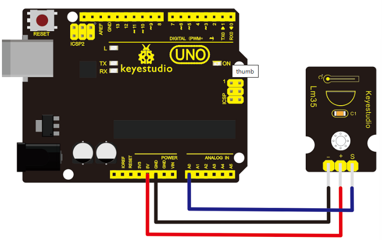
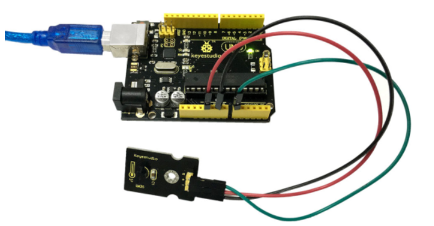

# KS0022 keyestudio LM35 Linear Temperature Sensor


## 1. Introduction

LM35 Linear Temperature Sensor is based on semiconductor LM35 temperature sensor. It can be used to detect ambient air temperature.

This sensor offers a functional range among 0 degree Celsius to 100 degree Celsius. Sensitivity is 10mV per degree Celsius. The output voltage is proportional to the temperature.

This sensor is commonly used as a temperature measurement sensor. It includes thermocouples, platinum resistance, and thermal resistance and temperature semiconductor chips.

The chip is commonly used in high temperature measurement thermocouples. Platinum resistance temperature sensor is used in the measurement of 800 degrees Celsius, while the thermal resistance and semiconductor temperature sensor is suitable for measuring the temperature of 100-200 degrees or below, in which the application of a simple semiconductor temperature sensor is good in linearity and high in sensitivity. The LM35 linear temperature sensor and sensor-specific Arduino shield can be easily combined.

## 2. Specification

- Based on the semiconductor LM35 temperature sensor
- Can be used to detect ambient air temperature
- Sensitivity: 10mV per degree Celcius
- Functional Range: 0 degree Celsius to 100 degree Celsius

## 3. Connection Diagram



## 4. Sample Code

Download Code:   [Code](./Code.7z)

```
void setup()
{
    Serial.begin(9600);//Set Baud Rate to 9600 bps
}

void loop()
{   
	unsigned int val;
    unsigned int dat;
    val=analogRead(0);//Connect LM35 on Analog 0
    dat=(500 * val) /1024;
    Serial.print("Temp:"); //Display the temperature on Serial monitor
    Serial.print(dat);
    Serial.println("C");
    delay(500);
}
```

## 5. Result



Wire it up as the above diagram and upload well the code to the board, then open the serial monitor and set the baud rate as 9600, finally you will see the current temperature value shown below. The value may be slight difference due to different place and weather.

